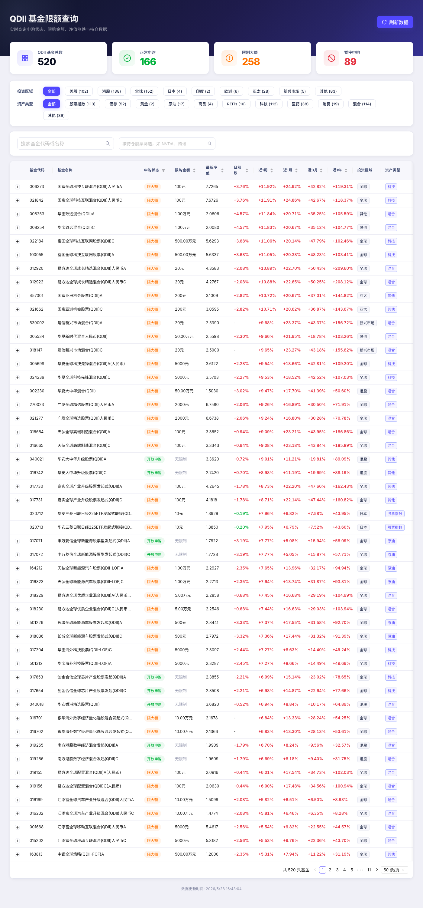

# QDII 基金限额查询

实时查询全市场 500+ 只 QDII 基金的申购状态、限购金额、净值涨跌与前十大持仓。



## 核心功能

- 申购状态与限购金额实时展示，支持排序
- 按投资区域、资产类型、基金名称、持仓股票多维度筛选
- 按持仓股票筛选时动态插入占比列（如筛选 NVDA，展示各基金持仓英伟达的比例）
- 展开行查看前十大持仓明细，标注净值日期与持仓报告期
- 数据缓存持久化，刷新失败自动继承旧数据，确保稳定可用

## 技术栈

- **前端**: React 18 + TypeScript + Ant Design 5 + Vite 6
- **后端**: Node.js + Express + TypeScript
- **数据**: 爬取天天基金（eastmoney.com）
- **项目结构**: npm workspaces monorepo

## 快速开始

```bash
# 确认环境（Node.js >= 18，npm >= 8）
node -v && npm -v

# 克隆并安装
git clone https://github.com/liweilun2021/qdii-fund-tracker.git
cd qdii-fund-tracker
npm install

# 启动开发模式
npm run dev
```

访问 http://localhost:5173 ，首次启动约 2-3 分钟完成全量数据抓取。
